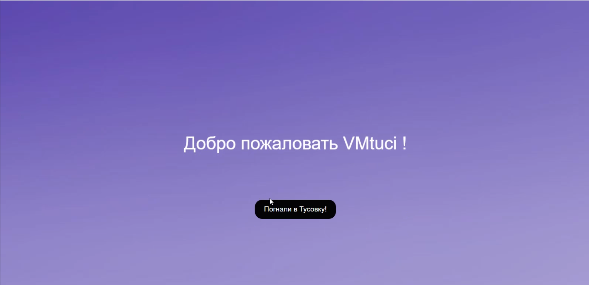
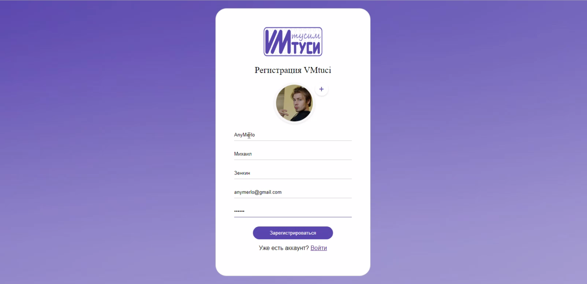
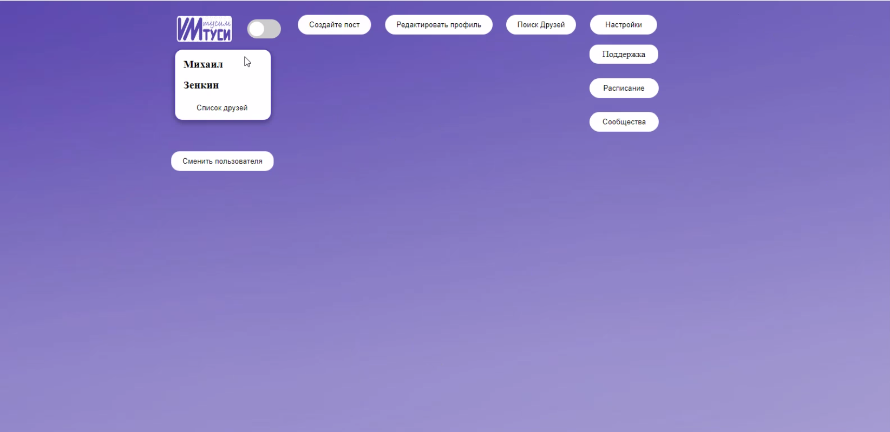
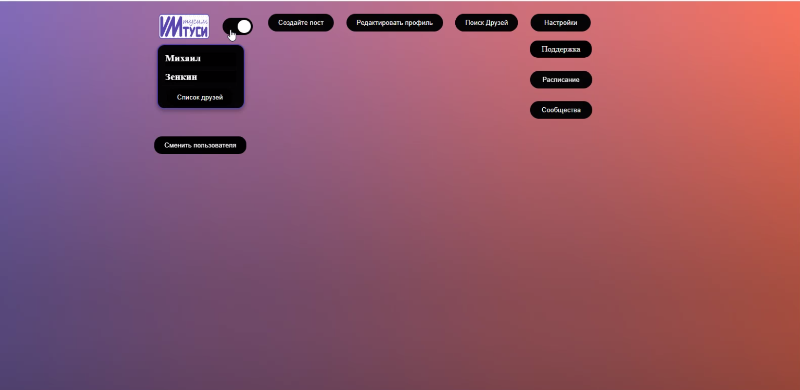
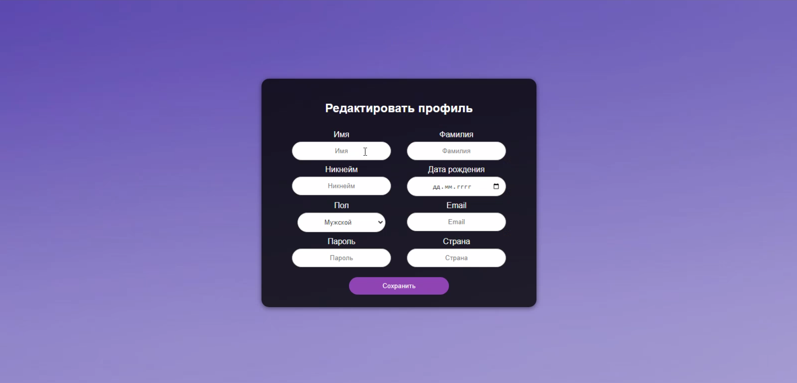
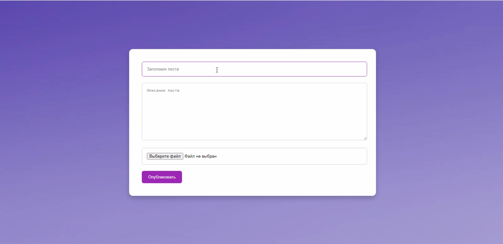
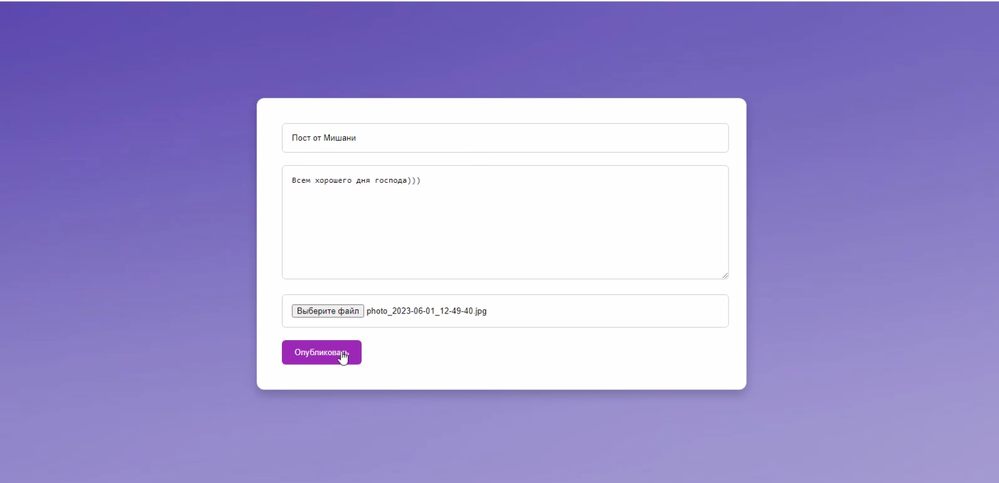
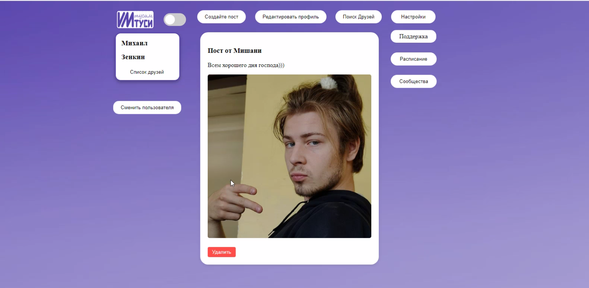
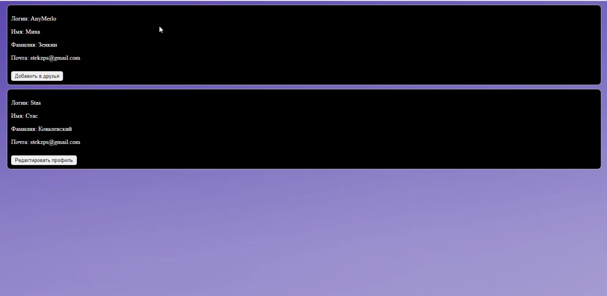

# **VMTUCI**

  
Содержание

  <ol>
    <li>
      <a href="#о-проекте">О проекте</a>
      </li>
        <li><a href="#инструменты">Инструменты</a></li>
      </ul>
    </li>
    <li>
      <a href="#инструкция">Инструкция по использованию</a>
      <ul>
       <li><a href="#предварительные-условия">Предварительные условия</a></li>
        <li><a href="#установка">Установка</a></li>
      </ul>
    </li>
    <li>
      <a href="#devOps-и-тестирование">DevOps и тестирование</a>
      <ul>
       <li><a href="#контейнеризация">Контейнеризация</a></li>
        <li><a href="#тесты">Тесты</a></li>
      </ul>
      </li>
    <li><a href="#функционал">Функционал</a></li>
    <ul>
    <li><a href="#приветсвие">Приветсвие</a></li>
    <li><a href="#регистрация">Регистрация</a></li>
        <li><a href="#вход">Вход</a></li>
        <li><a href="#выбор-темы">Выбор темы</a></li>
        <li><a href="#настройки-профиля">Настройки профиля</a></li>
        <li><a href="#публикация-постов">Публикация постов</a></li>
        <li><a href="#поиск друзей">Поиск друзей</a></li>
        <li><a href="#просмотр расписания">Просмотр расписания</a></li>
        <li><a href="#поддержка">Поддержка</a></li>
        <li><a href="#сообщества">Сообщества</a></li>
      </ul>
    <li><a href="#разработчики">Разработчики</a></li>
  </ol>

## **О проекте**

***VMTUCI*** - это социальная сеть для студентов Московского Технического Универститета Связи и Информатики (МТУСИ). 

>**В нашей социальной сети вы можете выложить пост, найти друзей и даже посмотреть расписание!** 

## **Инструменты**
+ PyCharm как интегрированная среда разработки (IDE)

+ HTML/CSS для структуры и стиля страниц

+ Flask как микрофреймворк для создания веб-приложения

+ Figma для дизайна интерфейса

## **Инструкция по пользованию**
### *Предварительные условия*

+ [X] Установленный **Python 3.x**
+ [X] Установленный **PyCharm** или любая другая **IDE** поддерживающая разработку на **Python**
  
### *Установка*
1. Клонировать репозиторий проекта через **Git** или скачать архивом
2. Открыть терминал или командную строку и перейти в директорию проекта
3. Установить виртуальное окружение: **'python -m venv venv'**
4. Активировать виртуальное окружение:
    + На *Windows*: **'venv\Scripts\activate'**
    + На *macOS/Linux*: **'source venv/bin/activate'**
5. Установить зависимости: **'pip install -r requirements.txt'**
6. Запустить приложение: **'python app.py'**
  

## **DevOps и тестирование**
### *Контейнеризация*
ну что-нибудь про контейнеры надо написать
### *Тесты*
тесты по каждой части + ci/cd

## **Функционал**
### *Приветствие*

### *Регистрация*
В нашей социальной сети есть система регистрации и входа с проверкой на исключения. Также при регистрации можно сразу поставить аватар вашего профиля.

Для регистрации нужно ввести следующие данные:
+ логин (обязательно должен быть символ @)
+ имя
+ фамилия
+ почта 
+ пароль (минимум 8 символов)
  

### *Вход*
При входе у пользователя запрашивается:
+ логин или почта
+ пароль

### *Выбор темы*
Также можно выбрать темную или светоую темы. 

Чтобы это сделать достаточно щелкнуть по ползунку, который находится в верхнем левом углу.

### *Настройки профиля*
Уже зарегистрировавшись, вы сможете отредактировать свой профиль!

>Вы сможете поменять: 
>+ имя
>+ фамилию
>+ никнейм
>+ дату рождения
>+ пол
>+ email
>+ пароль
>+ страну
  

### *Публикация постов*
**VMTUCI за открытое выражение своих мыслей!**

Если захотите поделиться новостью, что-то спросить или пошутить, то смело выкладывайте пост!

Для начала напиши заголовок вашего поста, например: 
>"Пост от Мишани"

Напишите сам пост и при желании прикрепите к нему файл.

Осталось только выложить запись!
При желании можно удалить ваш пост. Для этого нужно навестись на него и нажать на кнопку "удалить".

### *Поиск друзей*

### *Просмотр расписания*
>Забыли какие у вас пары? Не страшно! Ведь, справа у вас есть расписание, где вы сможете освежить свою память!

### *Поддержка*
Если у вас есть какие-либо проблемы или предложения, не стесняясь, пишите в поддержку!

Поддержка **VMTUCI** представляет собой телеграмм бота, который с радостью вас выслушает и направит к вам специалиста <3
### *Сообщества*
Мы побоялись, что вам может быть скучно, поэтому добавили сообщеста.
Надеямся, что скучать вы не будете, а о интересных новостях расскажете своим друзьям через пост в **нашей социальной сети**!

>*Весь функционал **VMTUCI** можно также посмотреть по ссылке* - https://youtu.be/9uS3pWwl6wQ?si=LR7MpdNbxY39JlKd

## **Разработчики**
  
 
  
Зенкин Михаил
 
  <ul>
    <li>Beck-end разработчик</li>
    <li>telegram - @Anymerlo</li> 
    </ul>
  

  
 
  
Ковалевский Стас
 
  <ul>
    <li>Front-end разработчик</li>
    <li>Beck-end разработчик</li>
    <li>telegram - @nihaobrat</li>
  </ul>
  

  
 
  
Эллиот Кристофер Уолкер
  
  <ul>
    <li>UI/UX дизайн</li>
    <li>помощь DevOps-инженеру</li>
    <li>telegram - @chriselli_official</li> 
  </ul>
  

  
 
  
Найданова Элина
 
  <ul>
    <li>UI/UX дизайн</li>
    <li>Документация</li>
    <li>telegram - @anarieli</li>
  </ul>
  

  
 
  
Филимонов Иван
 
  <ul>
    <li>DevOps-инженер</li>
    <li>telegram - @JolyCole</li>
  </ul>
  

  
 
  
Назарова Анна
 
  <ul>
    <li>UI/UX дизайн</li>
    <li>Документация</li>
    <li>telegram - @aniiiiiiichka</li>
  </ul>
  
