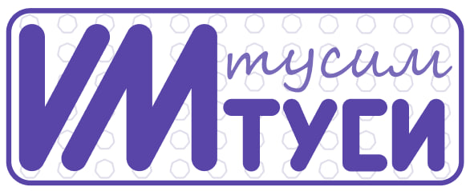
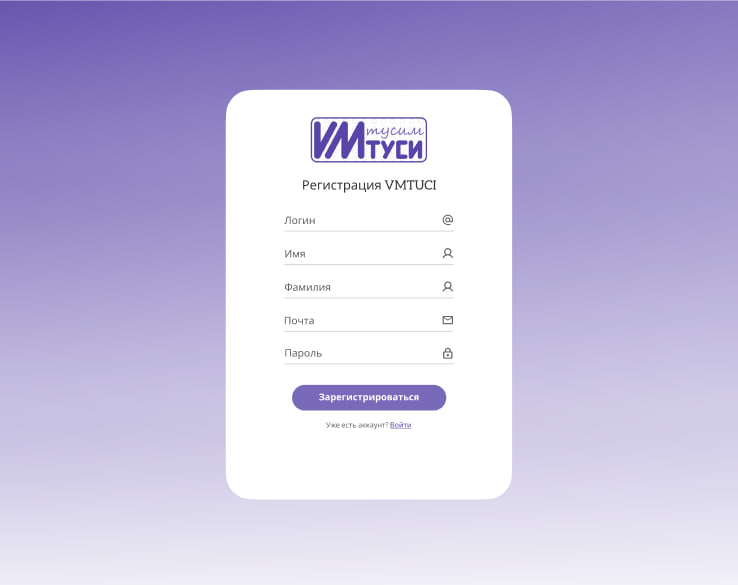
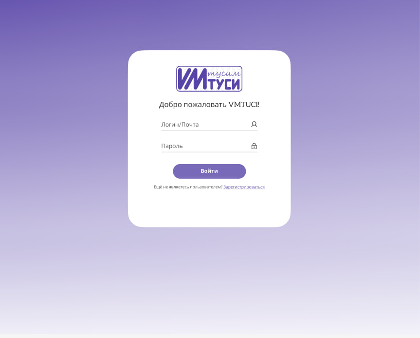

# **VMTUCI**

  
Содержание

  <ol>
    <li>
      <a href="#о-проекте">О проекте</a>
      </li>
        <li><a href="#инструменты">Инструменты</a></li>
      </ul>
    </li>
    <li>
      <a href="#инструкция">Инструкция по использованию</a>
      <ul>
       <li><a href="#предварительные-условия">Предварительные условия</a></li>
        <li><a href="#установка">Установка</a></li>
      </ul>
    </li>
    <li><a href="#функционал">Функционал</a></li>
    <ul>
    <li><a href="#приветсвие">Приветсвие</a></li>
    <li><a href="#регистрация">Регистрация</a></li>
        <li><a href="#вход">Вход</a></li>
        <li><a href="#выбор-темы">Выбор темы</a></li>
        <li><a href="#выбор-градиента">Выбор градиента</a></li>
        <li><a href="#настройки-профиля">Настройки профиля</a></li>
        <li><a href="#публикация-постов">Публикация постов</a></li>
        <li><a href="#поиск друзей">Поиск друзей</a></li>
        <li><a href="#просмотр расписания">Просмотр расписания</a></li>
      </ul>
    <li><a href="#разработчики">Разработчики</a></li>
  </ol>

## **О проекте**

***VMTUCI*** - это социальная сеть для студентов Московского Технического Универститета Связи и Информатики (МТУСИ). 

>**В нашей социальной сети вы можете выложить пост, найти друзей и даже посмотреть расписание!** 

## **Инструменты**
с помощью чего вообще делали
## **Инструкция по пользованию**
### *Предварительные условия*
### *Установка*

## **Функционал**
### *Приветствие*

### *Регистрация*
В нашей социальной сети есть система регистрации и входа с проверкой на исключения. 

Для регистрации нужно ввести следующие данные:
+ логин (обязательно должен быть символ @)
+ имя
+ фамилия
+ почта 
+ пароль (минимум 8 символов)

### *Вход*
При входе у пользователя запрашивается:
+ логин или почта
+ пароль

### *Выбор темы*
Также можно выбрать темную или светоую темы. 

Чтобы это сделать достаточно щелкнуть по ползунку, который находится 
### *Выбор градиента*
### *Настройки профиля*
### *Публикация постов*
### *Поиск друзей*
### *Просмотр расписания*

## **Разработчики**
  
 
  
Зенкин Михаил
 
  <ul>
    <li>Beck-end разработчик</li>
    <li>telegram - @Anymerlo</li> 
    </ul>
  

  
 
  
Ковалевский Стас
 
  <ul>
    <li>Front-end разработчик</li>
    <li>Beck-end разработчик</li>
    <li>telegram - @nihaobrat</li>
  </ul>
  

  
 
  
Эллиот Кристофер Уолкер
  
  <ul>
    <li>UI/UX дизайн</li>
    <li>помощь DevOps-инженеру</li>
    <li>telegram - @chriselli_official</li> 
  </ul>
  

  
 
  
Найданова Элина
 
  <ul>
    <li>UI/UX дизайн</li>
    <li>Документация</li>
    <li>telegram - @anarieli</li>
  </ul>
  

  
 
  
Филимонов Иван
 
  <ul>
    <li>DevOps-инженер</li>
    <li>telegram - @JolyCole</li>
  </ul>
  

  
 
  
Назарова Анна
 
  <ul>
    <li>UI/UX дизайн</li>
    <li>Документация</li>
    <li>telegram - @aniiiiiiichka</li>
  </ul>
  
